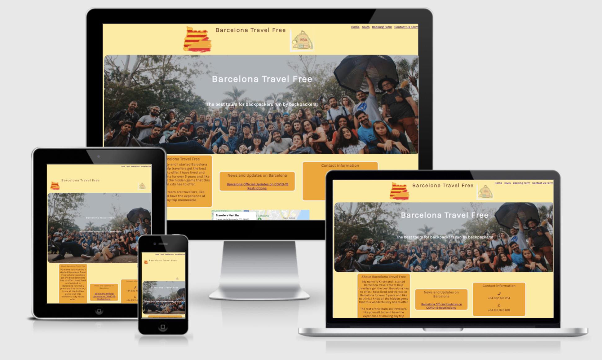
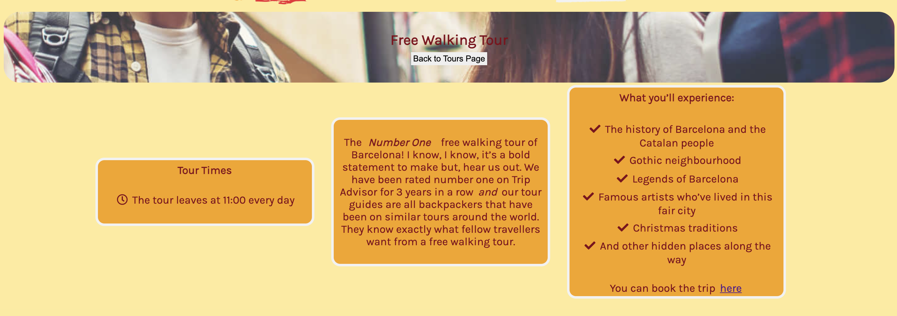
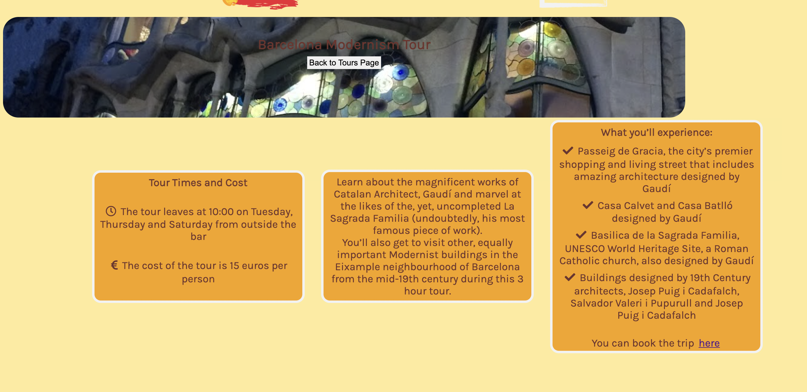

# Barcelona Travel Free

## Site Overview

Barcelona Travel Free is a travel company and is a site that hopes to help backpackers visiting Barcelona with activities that are suited to this particular type of traveller. The site is targeted at backpackers or other travellers that enjoy unconventional types of tours when visiting a different city around the world. This site is targeted towards this demographic as it enables them to socialise with like minded people while seeing different parts of the city and Cataluyna too.

## Planning Stages

### Site Aims

* To offer a space for like-minded travellers to join together for tours and friendship
* Provide tours that cater towards this demographic
* Provide a way online that is clear and easy for site users to book the tour or tours of their choice

### Wireframes

While designing the site, I wanted to have on paper my ideas for the end result. I completed wireframes for this reason via [Balsamiq](https://balsamiq.com/). 

Although, my original ideas changed during the process, they are now features for future enhancements instead.

* [(Homepage](assets/../docs/Wireframes/homepage-wireframe.png)
* [Getting There](assets/../docs/Wireframes/gettingthere-wireframe.png)
* [The Bar](assets/../docs/Wireframes/bar-wireframe.png)
* [Tours](assets/../docs/Wireframes/tours-wireframe.png)
* [Booking/Payment](assets/../docs/Wireframes/booking-wireframe.png)
* [Contact Us](assets/../docs/Wireframes/contact-wireframe.png)

### Color Schemes

For this project, I wanted the color scheme to match the Catalan colors but also be accessable for visually impaired users. I decided to use [Adobe Color](https://color.adobe.com/) as it has an accessibility feature that allows you to see how different themes are accessible for this disability group. 

The color schemes I chose passed the accesibility tests. As I have a contrasting color for the box elements, I ensured both passed the tests set by Adobe Color.

## Current Features used on all pages

### Header Element

I wanted something similar but eye-catching and I used the images that I did as they encompass the company’s belief of being for backpackers and also, that, by using the flags merged together, symbolising that Cataluyna is different but still joined together with Spain. 

### Navigation Bar

* The navigation bar appears on all 4 main pages and also the 6 information pages for the tours offered.
* It contains links to the homepage, tours page, booking form and contact form. 
* It will always stick to the top of the page allowing easy access for navigation around the website

### Footer

* The footer includes links to all of Barcelona Travel Free’s social media pages. The links open in a new tab for easy user navigation.
* The icons used to represent each social media platform were imported from Font Awesome.
* --Information about Terms and Conditions-- 

## Current Features to unique individual pages

### Homepage

* I used a simple but eye catching box layout that was used throughout the design to give it a streamlined user experience.
* A place for visitors to get instant information about who Barcelona Travel Free is.
* A direct link to easily check the current COVID restrictions in Barcelona.
* A navigation bar at the top right hand corner of the page with links to each of the 4 website pages for quick access at all times. 
* A Google Map iframe element with the address of the company’s office. The address on the map is not correct for Barcelona Travel Free but is in the vicinity of where I envision the office to be in Barcelona.

### Tours page

* I used the same box layout showcasing the 6 tours offered with links to their own information page
* I originally was going to have all the tours and information section on one page but decided to change this format as the page was starting to look to crowded and this would not have been a good experience for the user.
* Upon clicking on the information link for the tour, the 3 box layout is used again throughout with each box having specific information that shows a good customer journey.
* I have also included a direct link to the booking page at the bottom of the “What you’ll experience”/”What’s included” section for easy accessibility to book the tour wanted.
* I’ve also included a hero banner at the top of the boxes representing the particular tour that stretches across the screen.

### Booking page

* The booking page has one main box that has a form to fill out for booking tours
* I’ve included required fields for name, email address, telephone number and tour option so that I know who has sent the information and who to respond directly too.
* I’ve included a further information box for the user to include any further information they feel is valuable for their booking.

### Contact Us page

* Is similar in layout to the booking page but only the first name and email fields are required as this is basic information to respond directly to any feedback or query the user has.
* I have also included the telephone number and WhatsApp number for the user to contact me via that method if preferred. 

## Future Enhancements

I want the booking page to be more interactive and allow users to book and pay for their tours directly through the website. To achieve this, I want update the current booking form to enable this with fields for Credit/Debit card and PayPal input. A basket field to highlight what tour/tours have been booked and the total cost for that transaction.

Initially, I also wanted to add a “Getting Here” and “The Bar” pages. I want to use the same box-grid layout but provide information on different transport methods to reach Barcelona in the Getting Here page and for The Bar page, I want to have sections for a food menu, drinks menu and events listing section. This would further enhance the Barcelona Travel Free brand and make it more appealing for a tourism option in Barcelona for backpackers.

## Testing

## Deployment

I deployed my project on GitHub pages via the following procedure:

1. From the project's repository, go to the **Settings** tab
2. From the menu on the left-hand side, select the **Pages** tab
3. In the **Source** section, select the option for **Main** branch in the drop down menu and click **Save**
4. A message will be displayed to advise the project owner of a successful deployment to GitHub pages and the live link will be provided also

The live site via the following URL - [Barcelona Travel Free](https://justkirst.github.io/barcelona-travel-free/)

## Credits

## Content

* All content on the website was written by myself
* Fonts were sourced from [Google Fonts](https://fonts.google.com/)
* Icons were sourced from [Font Awesome](https://fontawesome.com/icons)

## Media

* The header logo images were sourced from [Canva](https://www.canva.com/en_gb/)
* The photos used were sourced from [Freepix](https://www.freepik.com/) and [Shutterstock](https://www.shutterstock.com/)
* Photos used on the tour information pages except for the Free Walking Tour and Foodie Trip information pages were taken by me.
